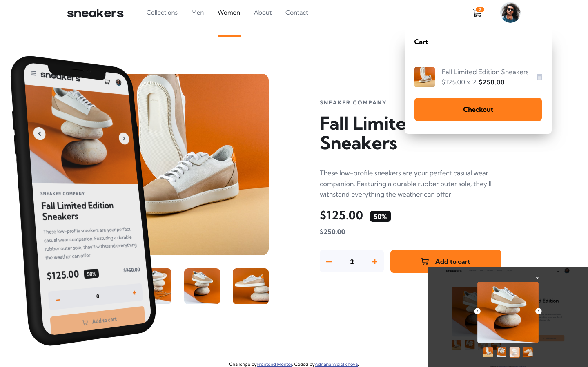

# Frontend Mentor - E-commerce product page solution

This is a solution to the [E-commerce product page challenge on Frontend Mentor](https://www.frontendmentor.io/challenges/ecommerce-product-page-UPsZ9MJp6). 

## Table of contents

- [Overview](#overview)
  - [The challenge](#the-challenge)
  - [Screenshot](#screenshot)
  - [Links](#links)
- [My process](#my-process)
  - [Built with](#built-with)
  - [What I learned](#what-i-learned)
  - [Continued development](#continued-development)
  - [Useful resources](#useful-resources)
  - [AI Collaboration](#ai-collaboration)
- [Author](#author)
- [Acknowledgments](#acknowledgments)

## Overview

### The challenge

This project is an E-commerce challenge from Frontend Mentor. My goal was to create a functional product page with a basket that is fully responsive.
Users should be able to:

- View the optimal layout for the site depending on their device's screen size
- See hover states for all interactive elements on the page
- Open a lightbox gallery by clicking on the large product image
- Switch the large product image by clicking on the small thumbnail images
- Add items to the cart
- View the cart and remove items from it

**Functionality:**
- Dynamic data loading from `data.json`.
- Interactive gallery with image switching via thumbnails.
- Functional basket (adding, removal, validation of the empty basket).
- Responsive design (Mobile-first).

### Screenshot



### Links

- Solution URL: [GitHub Repository URL](https://github.com/Saliva-sys/E-commerce-product-page.git)
- Live Site URL: [saliva-e-commerce.netlify.app](https://saliva-e-commerce.netlify.app/)

## My process

### Built with

- Semantic HTML5 markup
- CSS custom properties (Variables)
- CSS BEM 
- Flexbox & Responsive design (Clamp function)
- Mobile-first workflow
- [React](https://reactjs.org/) - JS library
- [Vite](https://vitejs.dev/) - Frontend Tooling

### What I learned

This project was a major step forward in my understanding of React's asynchronous nature and complex state management. I focused on building a robust shopping cart logic and an interactive product gallery.

*1. Asynchronous Data Fetching (useEffect)*

I practiced simulating a real-world API call by fetching product data from a local JSON file. This helped me understand how to handle loading states and prevent the app from crashing before data arrives.

```js
useEffect(() => {
  fetch('data.json')
    .then(response => response.json())
    .then(data => {
      setProducts(data);
      if (data.length > 0) {
        setProductImages(data[0].image[0].picture);
      }
    })
    .catch(error => console.error("Error loading data:", error));
}, []);
```
*2. Complex State Logic (Cart & Gallery)*

I implemented a multi-layered state system to handle user interactions. This included tracking the selected image in the gallery and managing the visibility of the cart overlay based on both user clicks and product quantity.

```js
const [productImages, setProductImages] = useState(); // Main gallery image
const [quantity, setQuantity] = useState(0);         // Product counter
const [isCartOpen, setIsCartOpen] = useState(false);  // Cart visibility
```

3. Dynamic UI & Conditional Rendering
I learned how to create a "smart" cart that changes its layout based on whether it's empty or contains items. I also used template literals to dynamically apply active classes to thumbnails.

```js
// Conditional rendering for the cart content
{!addCart || quantity === 0 ? (
  <div className="empty__cart">Your cart is empty</div>
) : (
  <div className="product__list">{/* Cart items */}</div>
)}

// Dynamic class for active thumbnail
className={productImages === item.picture ? "thumbnail--active" : "thumbnail"}
```

*4. Math Logic & Data Formatting*

I practiced working with JavaScript math functions to calculate the total price dynamically and ensured the output is always formatted correctly for a professional e-commerce feel.

```js
<span className="cart__product-price-total">
  { (products[0]?.price * quantity).toFixed(2) }
</span>
```

*5. Manage complex visual effects*

I learned how to manage complex visual effects by layering elements. When a single CSS box-shadow wasn't giving me the depth I wanted for the cart overlay, I experimented with a dedicated shadow layer to gain finer control over the elevation and blur. This forced me to think more deeply about which CSS properties were the most effective for the specific layout and why one solution was better than another in a given context.

```css
/* Example of the layered approach for the cart shadow */
.cart__shadow-layer {
  display: flex;
  position: absolute;
  width: 100%;
  min-height: 15rem;
  z-index: 1;
  /* Multi-directional shadow for enhanced depth */
  box-shadow: -0.5rem 2rem 2rem -0.5rem rgba(0, 0, 0, 0.2), 
               0.5rem 2rem 2rem -0.5rem rgba(0, 0, 0, 0.2);
}
```

*6. Smooth Hover Effects with Outline*

I learned that for CSS transitions to work, the property specified in the transition must match the property being changed on hover. I also practiced using transparent outlines to create smooth focus and hover effects without causing layout shifts.

```css
/* Example of a stable hover effect using outline */
.avatar__button-img {
  border-radius: 50%;
  outline: 0.15rem solid transparent; /* Placeholder to enable smooth transition */
  transition: outline-color 0.3s ease;
}

.avatar__button-img:hover {
  outline-color: var(--color-orange); /* Smoothly reveals the highlight */
}
```

### Continued development

In future projects, I want to focus on:
- **State Management:** Exploring more robust solutions like Redux Toolkit or Context API for larger applications where passing props becomes too complex.
- **Backend Integration:** Moving from a static `data.json` to a real backend (Node.js/Express) with a database (MongoDB/PostgreSQL) to handle real orders and user accounts.
- **Automated Testing:** Implementing Unit tests (Jest) and End-to-End tests (Cypress) to ensure the cart logic remains bug-free during updates.
- **Security Basics:** Learning how to sanitize user inputs and secure API routes to prevent common vulnerabilities like XSS or Injection attacks.

### Useful resources

- [Variable Fonts Guide (MDN)](https://developer.mozilla.org/en-US/docs/Web/CSS/Guides/Fonts/Variable_fonts) - This guide helped me understand how to implement the Work Sans variable font and control font weights dynamically.
- [BEM Methodology](https://getbem.com/) - Using BEM helped me keep my CSS organized and avoid naming conflicts, which is crucial for larger projects.
- [Clamp Generator](https://clampgenerator.com/) – This tool was essential for calculating fluid values for my layout, allowing the design to scale perfectly between mobile and desktop.
- [CSS Flexbox Layout Guide](https://css-tricks.com/snippets/css/a-guide-to-flexbox/) – This is my go-to reference for Flexbox. It helped me perfectly align the icons and headings within the accordion buttons.

### AI Collaboration

This project was created in cooperation with the AI Assistant (Gemini - Free).

*How do I use it?*

- Architecture and logic: AI helped me design the structure of states (useState) for the basket and switching images in the gallery.
- Debugging: Together we solved problems with asynchronous data loading data from data.json and handling conditional rendering while data is loading.
- CSS Layout: Help in tuning more complex media queries and fix positions for cart layers (cart__shadow-layer vs cart__content-layer).
- Brainstorming: We were looking for the best way to manage the relationship between the main image and the views (thumbnails).

*What worked well?*

- Iteration speed: It was great that I could describe the error (e.g. why the basket did not disappear at zero) and AI explained to me the logic of conditional rendering.
- Explaining "why": AI didn't just give me a finished code, but explained to me the meaning of functions like .toFixed(2) or working with prev status in hooks.

*What didn't work well?*

- File context: Occasionally, AI lost track of the exact class names in my CSS if we haven't updated the context of the entire file for a long time, which led to minor inconsistencies in style. However, this turned out to be beneficial; it forced me to think critically about the connections within my code and ensured I fully understood how every part of the application works instead of just relying on generated snippets.
- Visual details: AI does not see the resulting render, so when tuning the "pixel-perfect" details (like the exact position of the icon basket on mobile) I had to rely on my own eye and DevTools. This pushed me to think more deeply about which CSS properties were the most effective for the specific layout and why one solution was better than another in a given context.

## Author

- Frontend Mentor - [@Saliva-sys](https://www.frontendmentor.io/profile/Saliva-sys)
- GitHub - [Saliva-sys](https://github.com/Saliva-sys)

## Acknowledgments

I would like to thank the Frontend Mentor community for providing such great challenges to practice real-world web development skills.
